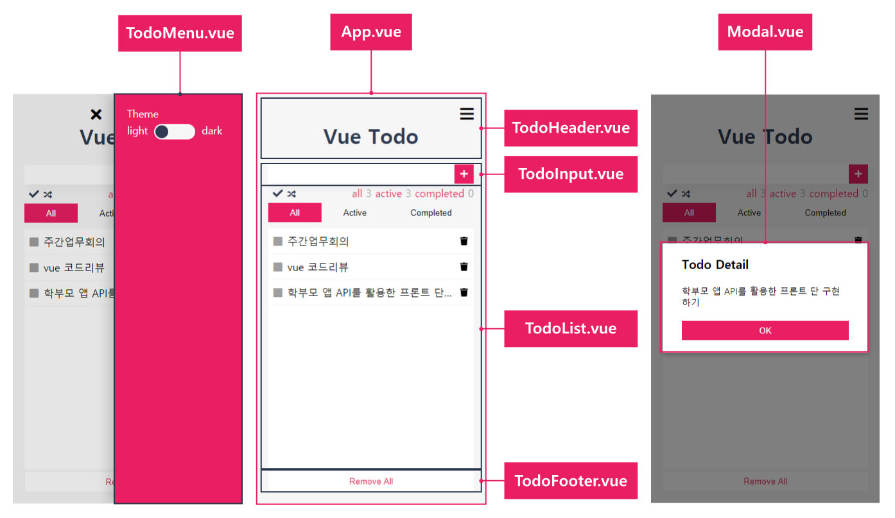
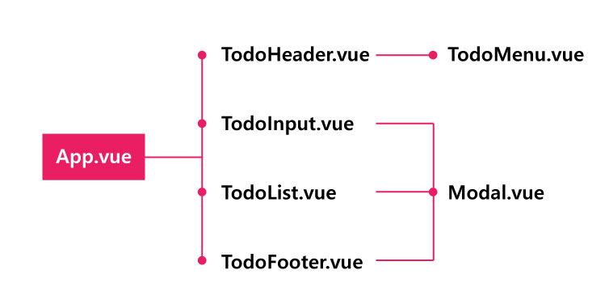
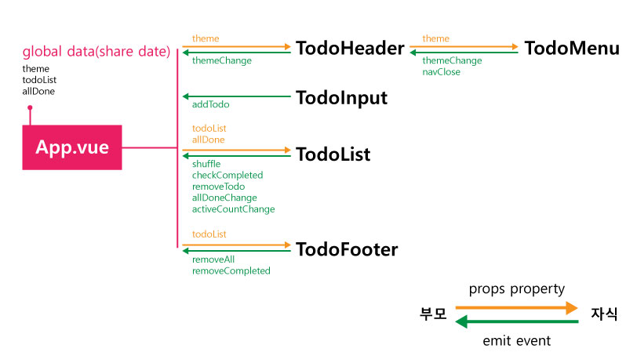
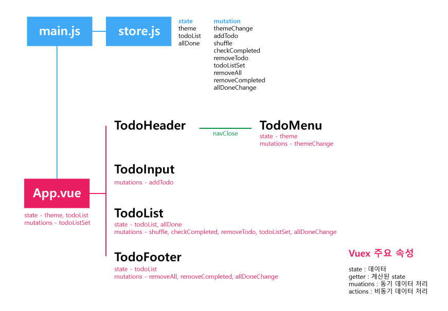

# Todo 프로젝트

## 목차
- [vue cli를 이용한 프로젝트 구성](#vue-cli를-이용한-프로젝트-구성)
- [컴포넌트 기반 설계](#컴포넌트-기반-설계)
- [컴포넌트 통신](#컴포넌트-통신) 
- [Vuex를 이용한 상태관리 - 리팩토링](#vuex를-이용한-상태관리)
- [애니메이션 적용 transition](#애니메이션-적용-transition)
 
# [`vue cli를 이용한 프로젝트 구성`](#todo-프로젝트)
## 프로젝트 생성, 실행, 빌드
`생성`
> vue create vue-todo
 
`프로젝트 경로로 이동`
> cd vue-todo  

`프로젝트 실행`
> npm run serve  
> or  
> yarn serve

`빌드`
> npm run build  
> or  
> yarn build

## js 라이브러리 설치
> npm i 라이브러리명    
> npm i 라이브러리명 -D
- vuex : 상태 관리
- axios : 비동기 데이터 처리
- copy-webpack-plugin : 정적폴더 build
- fontawesome : 아이콘 사용
- lodash : _.메소드()로 사용되는 라이브러리
- es6-promise : IE에서 promise객체를 사용한 비동기 작업 수행
- node-sass, sass-loader : sass 사용
- vue2-touch-events : touch 이벤트

## vue.config.js 설정
- publicPath : 기본 경로 설정
- css loader 설정
- build 경로 설정

## main.js 설정
- 전역 컴포넌트, router, store를 등록한다.

# [`컴포넌트 기반 설계`](#todo-프로젝트)


## 전체 컴포넌트 구성
- App 메인 컴포넌트
  - TodoHeader 제목, 메뉴바 제어
    - TodoMenu 테마변경
  - TodoInput 할일 작성
    - Modal 빈값 알림
  - TodoList 할일 목록, 셔플, 필터, 항목 수, 한건 삭제, 할일 체크
    - Modal 할일 상세
  - TodoFooter 
    - Modal 삭제 알림



# [`컴포넌트 통신`](#todo-프로젝트)



## props : 데이터 전달
부모가 자식 컴포넌트로 데이터를 전달할 경우 사용  
[props](https://kr.vuejs.org/v2/guide/components-props.html)  

`App.vue`   
```html
<!-- <TodoHeader :props속성명="전달할 데이터"/> -->
<TodoHeader :theme="theme"/>
<!-- or -->
<TodoHeader v-bind:theme="theme"/>
```
```javascript
data() {
    return {        
      theme:'light',      
    }
  },
```
`TodoHeader.vue`

```js
// props:['부모에서 설정한 props명']
props:['theme']
```
```html
<div>{{theme}}</div>
```
## emit : 이벤트 전달
자식이 부모 컴포넌트로 이벤트를 전달할 경우 사용  
[사용자 지정 이벤트](https://kr.vuejs.org/v2/guide/components.html#v-on을-이용한-사용자-지정-이벤트)  

`TodoHeader.vue`
```html
<!-- <input type="checkbox" @이벤트명="이벤트 발생시 실행할 메소드명"> -->
<input type="checkbox" @change="themeChange">
<!-- or -->
<input type="checkbox" v-on:change="themeChange()">
```

```js
  methods: {
    themeChange:function (value) {
      // this.$emit('부모쪽에서 인지할 수 있는 이벤트명',인자값);  
      this.$emit('themeChange',value);            
    }
  },
```
`App.vue`   
```html
<!-- <TodoHeader @자식에서 설정한 emit이벤트명="이벤트 발생시 실행할 메소드명"/> -->
<TodoHeader @themeChange="themeChange"/>
```
```javascript
methods:{
    themeChange:function (value) {
        //something...    
    }   
}
```

# [`Vuex를 이용한 상태관리`](#todo-프로젝트)



# [`애니메이션 적용 transition`](#todo-프로젝트)

[리스트 트랜지션](https://kr.vuejs.org/v2/guide/transitions.html#리스트-이동-트랜지션)  
`template`
```html
<button v-on:click="shuffle">Shuffle</button>
<transition-group name="flip-list" tag="ul">
    <li v-for="item in items" v-bind:key="item" class="list-item">
        <span>{{ item }}</span>
    </li>
</transition-group>
```

`js`
```js
    data() {
        return {
            items: [1,2,3,4,5,6,7,8,9],
        }
    },
    methods: {
        shuffle: function () {
            this.items = _.shuffle(this.items)
        }
    }
```
`css`
```css
    .flip-list-move {
        transition: transform 1s;
    }
```
