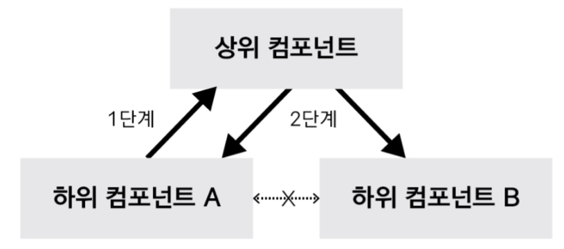

# Vue.js 시작하기

## 참고 링크 
- [Vue 공식문서](https://vuejs.org/v2/guide/)
- [Vue 스타일 가이드](https://vuejs.org/v2/style-guide/)
- [Vue Cookbook](https://vuejs.org/v2/cookbook/) - 프로젝트시 문제 해결
- [Vuex](https://vuex.vuejs.org/)
- [VueRouter](https://router.vuejs.org/)
- [Vue CLI](https://cli.vuejs.org/)

<div id="contents">  

## 목차
1. [Reactivity](#1)
2. [인스턴스](#2) 
3. [컴포넌트](#3)
4. [컨포넌트 통신](#4)
5. [HTTP 통신 라이브러리(axios)](#5)
6. [템플릿 문법](#6)
7. [Vue CLI](#7)
8. [라우터](#8)
</div>

<div id="1">  

# 1.Reactivity
vue js가 추구하는 가장 중심사상이자 핵심기능  
데이터의 대한 변화를 vue에서 감지해서 화면에 반영  
화면 조작에 대한 api, 속성을 vue에서 제공

</div>
<div id="2">  

# 2.인스턴스
필수로 생성해야하는 단위이며 인스턴스안에 여러가지 내용을 추가할 수 있다.

`App.vue`
```html
<template>
    <div>
        {{num}}<br> 
        {{doubleNum}}<br> 
        {{fullName}}
        <p v-bind:class="errorTextColor">Hello</p>
    </div>
</template>

<script>
export default {
    //데이터
    data() {
        return {
            num: 10,
            firstName: 'Foo',
            lastName: 'Bar',
            fullName: 'Foo Bar',
            cname: 'blue-text',
            isError: false 
        }
    },
    // 기능
    methods: {
        // addNum: function() {
        //     this.num++;
        // },
        //서버 동작
        fetchUserByNumber: function(num, oldValue) {
            console.log(num, oldValue);
        }
    },
    // 매번 실행되기 부담스러운 무거운 동작들
    watch: {
        //num이 변경되면 메서드 실행
        num: function(newValue, oldValue) {            
            this.fetchUserByNumber(newValue, oldValue);
        },
        firstName: function(val) {
            this.fullName = val + ' ' + this.lastName;
        },
        lastName: function(val) {
            this.fullName = this.firstName + ' ' + val;
        }
    },
    // 단순값에 대한 계산, 데이터의 의존성
    computed: {
        doubleNum: function() {
            return this.num * 2;
        },
        fullName: function() {
            return this.firstName + ' ' + this.lastName
        },
        errorTextColor: function() {            
            return this.isError ? 'warning' : this.cname;
        }        
    },
}
</script>
<style>
    .warning {
        color: red;
    }
    .blue-text{
        color: blue;
    }
</style>
```
## 계산형 속성 computed 
메서드처럼 보이지만 속성처럼 사용하며 순수 값을 변형하여 사용할 때 유용하다.  
{{result}} => result 값을 적용시 계산이 필요하다면 computed로 처리 후 속성 이름만 적용해야한다.

`bad - 템플릿 리터럴에 바로 적용`
```javascript
{{
  fullName.split(' ').map(function (word) {
    return word[0].toUpperCase() + word.slice(1)
  }).join(' ')
}}
```
`good - computed로 적용`
```javascript
{{ normalizedFullName }}

computed: {
  normalizedFullName: function () {
    return this.fullName.split(' ').map(function (word) {
      return word[0].toUpperCase() + word.slice(1)
    }).join(' ')
  }
}
```

</div>
<div id="3">  

# 3.컴포넌트
화면의 영역을 구분해서 개발하는 방식  
UI는 컴포넌트 기반으로 개발하며 이는 코드의 재사용관점에서 유용하다.

vue-cli로 프로젝트를 생성하면 vue파일을 만들어서 파일별로 컴포넌트를 관리할 수 있다.

`전역 컴포넌트`
```javascript
Vue.component('some-comp', {
  data: function () {
    return {
      foo: 'bar'
    }
  }
})
```
`지역 컴포넌트`
```javascript
new Vue({
  data: {
    foo: 'bar'
  }
})
```
`.vue 파일(싱글 파일 컴포넌트)`
```javascript
export default {
  data () {
    return {
      foo: 'bar'
    }
  }
}
```

</div>
<div id="4">  

# 4.컨포넌트 통신
데이터의 흐름을 제어하기 위한 규칙을 제한
- props(상위에서 하위로) : 특정 컴포넌트에서만 사용되는 고유 속성 
- event emit(하위에서 상위로) : 특정 컴포넌트에서만 사용되는 고유 이벤트

## props name 규칙
props에서 카멜케이스로 작성했다면 html에서는 대소문자 구분이 없으므로 케밥케이스로 작성해야한다.
```html
<WelcomeMessage :greeting-text1="hi" :greetingtext2="hi"/>

<script>  
export default {
  props: {
    greetingText1: String,
    greetingtext2: String
  }
}
</script>

```

## 같은 레벨 컴포넌트 간의 데이터 공유 


`*같은 레벨 컴포넌트간의 직접적인 통신은 불가능하다.`

1. appContent컴포넌트에서 클릭 이벤트 발생하면 passNum()메소드 실행 
2. emit으로 pass이벤트와 10을 부모컴포넌트로 전달 
3. 부모쪽에서는 appContent컴포넌트에서 pass라는 이벤트가 감지되면 getNum()메소드 실행
4. getNum메소드는 전달받은 숫자를 data의 num에 적용 
5. appHeader컴포넌트는 getNum이라는 props속성에 num변수를 적용하였으므로
   템플릿 문법 중 {{}}으로 변경된 값을 적용한다.

```html
    <div id="app">
        <app-header :getNum="num"></app-header>
        <app-content @pass="get-num"></app-content>
    </div>
    <script>
        var appHeader = {
            template: '<div>header{{getNum}}</div>',
            props: ['getNum']
        }
        var appContent = {
            template: '<div>content <button @click="passNum">pass</button></div>',
            methods: {
                passNum: function() {
                    this.$emit('pass', 10)
                }
            },
        }
        new Vue({
            el: '#app',
            components: {
                appHeader,
                appContent
            },
            data: {
                num: 0
            },
            methods: {
                getNum: function(num) {
                    this.num = num;
                }
            },
        })
    </script>
```

## 데이터 흐름 제어 예제
`App.vue`
```html
<template>
  <div>
    <app-header :propdata="str" @renew="renewString"></app-header>
  </div>
</template>

<script>
import AppHeader from './components/AppHeader';
export default {
  name:'App',
  components:{ AppHeader },
  // components:{
  //   'app-header':AppHeader
  // },
  data: function () {
    return {
      str: 'Header'
    }
  },
  methods: {
    renewString:function(str){      
      this.str=str;    
    }
  },
}
</script>
```
`AppHeader.vue`

```html
<template>
  <div>
      <h1>{{propdata}}</h1>
      <button @click="sendEvent">send</button>
  </div>
</template>

<script>
export default {
    props:['propdata'],
    methods: {
        sendEvent:function(){
            this.$emit('renew','change');
        }
    },
}
</script>
```

</div>
<div id="5">  

# 5.HTTP 통신 라이브러리(axios)
`Promise based HTTP client for the browser and node.js`

Promise 기반으로 만들어진 브라우저 및 node.js를 위한 HTTP 클라이언트 라이브러리로써, 비동기 방식으로 HTTP 데이터 요청을 실행한다.  
복잡한 XMLHttpRequest를 다루지 않고 AJAX 호출을 할 수 있다.

## 주요 메서드 
- axios.request(config)
- axios.get(url[, config])
- axios.delete(url[, config])
- axios.head(url[, config])
- axios.options(url[, config])
- axios.post(url[, data[, config]])
- axios.put(url[, data[, config]])
- axios.patch(url[, data[, config]])

## axios 라이브러리 설치
> npm i axios

## axios 예제
`FormApp.vue`
```html
<template>
  <div>
    <h3>등록</h3>
    <form @submit.prevent="submitForm">
          <div>
              <label for="username">id</label>
              <input type="text" id="username" v-model="username">
          </div>
          <div>
              <label for="password">password</label>
              <input type="password" id="password" v-model="password">
          </div>
          <button type="submit">login</button>
    </form>
   
    <h3>조회</h3>
    <input type="text" v-model="id">
    <button @click="getUser">조회</button>
    <ul class="result" v-show="result">
      <li>id:{{result.id}}</li>
      <li>name:{{result.name}}</li>
      <li>username:{{result.username}}</li>
    </ul>
  </div>
</template>

<script>
import axios from 'axios';
export default {
  name:'formApp',
  data:function () {
    return {
      username:'',
      password:'',
      id:'',
      result:'',
    }
  },
  methods: {
    submitForm:function(){
      // e.preventDefault();      
      var url='https://jsonplaceholder.typicode.com/users';
      var data={
        username:this.username,
        password:this.password
      }      
      axios.post(url, data)
      .then((res)=>{
        console.log(res);        
      })
      .catch((err)=>{
        console.log(err);        
      });
    },
    getUser:function(){
      // 화살표 함수를 적용하지 않을 때는  // var vm = this;로 접근
      // 화살표 함수로 적용시       
      axios.get('https://jsonplaceholder.typicode.com/users?id='+this.id)
      .then(res => {
        console.log(res.data[0]);
        //vm.result=res.data[0];
        this.result=res.data[0];  
      })
      .catch((err)=>{
        console.log(err);        
      });
    }
    
  },
}
</script>
```

</div>
<div id="6">  

# 6.템플릿 문법
화면 조작 
- 데이터 바인딩 : reactivity방식
- 뷰 디렉티브 : v-on, v-if, v-model ...
  - v-on 은 @로 대체 가능 ex)v-on:click => @click
  - v-bind는 :로 대체 가능 ex)v-bind:propsdata => :propsdata

</div>
<div id="7">  

# 7.Vue CLI
프로젝트 생성시 명령어로 실행

## vue-cli 라이브러리 설치(전역)
> npm i @vue/cli -g

</div>
<div id="8">  

# 8. 라우터

뷰(화면) 전환
```html
    <script src="https://cdn.jsdelivr.net/npm/vue/dist/vue.js"></script>
    <script src="https://unpkg.com/vue-router/dist/vue-router.js"></script>
    <div id="app">
        <div>
            <router-link to="/login">login</router-link>
            <router-link to="/main">main</router-link>
        </div>
        <router-view></router-view>
    </div>
    <script>
        var LoginComponent = {
            template: '<div>login page</div>'
        }
        var MainComponent = {
                template: '<div>main page</div>'
            }
            //라우터 인스턴스 생성
        const router = new VueRouter({
            // url의 #값을 제거
            mode: 'history',
            //페이지의 라우팅 정보
            routes: [{
                //페이지의 url이름
                path: '/login',
                component: LoginComponent
            }, {
                path: '/main',
                component: MainComponent
            }]
        })

        new Vue({
            el: '#app',
            components: {
                LoginComponent,
                MainComponent
            },
            //라우터 등록
            router: router,
            data: {

            }
        })
    </script>
```
</div>


